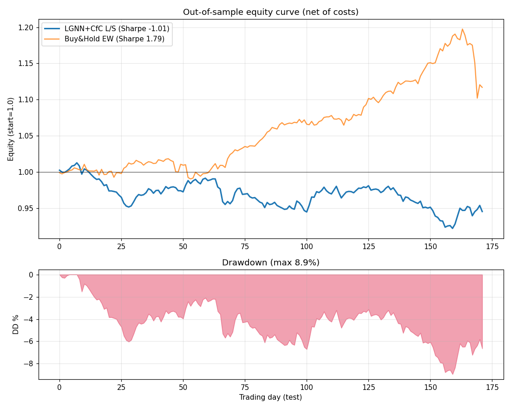

# Finance Trading Prototype — LGNN + CfC + Lens Suite (Phase 1)

A finance adaptation of the JCVI-Syn3A whole-cell emulator
(`colab_cell_emulator.py`, branch `claude/bio-inspired-neural-network-6dFAZ`).
We reuse the **Liquid Graph Neural Network + closed-form continuous-time (CfC)
backbone**, the **multi-lens pattern-discovery suite**, and the **two-tier rule
framework**, swapping the biology equation cores for finance ones, and the
Gaussian uncertainty head for a fat-tailed Student-t.

**Goal:** a minimum-viable backtest to decide whether this architecture has
edge in equities. If it doesn't, say so and stop. (It mostly doesn't — see the
verdict.)

- `colab_finance_emulator.py` — single runnable file (~1,500 lines)
- `colab_finance_emulator.ipynb` — auto-generated Colab notebook
  (`python scripts/build_finance_notebook.py`)
- `outputs/finance/equity_curve.png` — backtest equity curve + drawdown

---

## TL;DR verdict

> **KILL (as-built), but precisely diagnosed.**
> On a real out-of-sample test the LGNN+CfC model has **genuine gross signal**
> (rank-IC **+0.017**, IC-IR **+1.63**, gross Sharpe **+1.91**) — it is *not*
> producing noise. But it requires **1.8× daily turnover**, so after 5 bps/side
> costs the **net Sharpe is −1.01** (fails the `>0.5` bar). Slowing it down to
> cut turnover also kills the signal (smoothed Sharpe −0.09): the edge lives at
> the daily horizon and doesn't survive being held longer.
>
> The only robust, low-cost, net-positive alpha in the whole system is the
> plain **cross-sectional 12-1 momentum factor (Sharpe +1.17, 0.18× turnover)**
> — which **does not need the LGNN at all.** The graph/CfC machinery adds no
> net-of-cost value over a one-line factor here.
>
> **Recommendation: do NOT proceed to Phase 2 as specified.** Either kill, or
> run one tightly-scoped Phase-1.5 reframe (turnover-aware objective + longer
> holding horizon, anchored on momentum) — see "Recommendation" below. The real
> 2019-2024 verdict the spec asks for must be produced by the **Colab/yfinance
> run** (this sandbox's network blocks Yahoo Finance; details below).

---

## What was kept, replaced, dropped

| Biology component | Finance treatment | Notes |
|---|---|---|
| `DynamicsModel` (LGNN+CfC orchestration) | **kept** | feature panel → graph layers → return head |
| `_CfCGraphLayer` (Liquid CfC message passing) | **kept verbatim** | same `σ(-gate)·A + σ(gate)·B` update, degree-norm, residual+LayerNorm |
| `MetabolismCore` (bi-bi kinetics) | → `BetaCAPMCore` | `r_i = α_i + β_i·r_mkt`; β,α frozen from train OLS; r_mkt is a learned head over the pooled graph state |
| `CentralDogmaCore` (per-gene tx/tl) | → `MomentumCore` + `MeanReversionCore` | additive cross-sectional 12-1 momentum and short-horizon reversal terms (coeffs init from train, fine-tuned) |
| `VolumeCore` | **dropped** | no clean analog |
| `PINNHead` (stoichiometric mass balance) | **dropped** | Phase-2 candidate as a portfolio-balance constraint |
| ΔG° clamps | → **risk-limit projection** | prediction-space vol-band clamp (Tier-1) + portfolio box (≤5%/name, ≤25%/sector, ≤2:1 gross) |
| Gaussian `StochasticHead` | → **Student-t head (df=4)** | fat tails; trained with a Student-t NLL |
| knockout augmentation | → **halt augmentation** | zero a random ticker's return window during training |
| 6 lenses | **ported + retuned** | see lens table |
| two-tier (`RuleSet` / `Hypotheses`) | **ported** | Tier-1 hard projection (vol bands, enforced cointegration), Tier-2 soft aux loss |
| K-step rollout + TBPTT + refinement + σ-anchor | **ported** | short K (daily returns ≈ i.i.d.); refinement pass in last 10% |
| 9 v15.2 thermodynamic diagnostics (TUR, Helmholtz, Kramers, …) | **dropped** | physics-specific; `counterfactual_robustness` lives on as the halt-augmentation idea |

### Lens mapping (biology → finance)
| Biology lens | Finance lens | What it finds here |
|---|---|---|
| `lens_pairwise` | pairs trading | top \|r\|>0.85 return pairs (bank pairs dominate) + FDR |
| `lens_conservation` (SVD) | factor structure / cointegration baskets | largest dirs = risk factors; smallest = low-variance (mean-reverting) baskets |
| `lens_periodicity` (FFT) | calendar effects | day-of-week / turn-of-month seasonality |
| `lens_gene_chain` (lag) | lead-lag (sector) | who-leads-whom across sector aggregates |
| `lens_monotone` | trend regimes | persistent directional drift (≈none in equities) |
| `lens_bounds` | vol bands | per-name daily-return bounds → Tier-1 clamp |
| — | **`lens_lead_lag_multi`** (NEW) | cross-correlation at 1d/5d/30d lags, FDR-corrected |
| — | **`lens_correlation_regime`** (NEW) | HMM (or median fallback) on rolling avg correlation → risk-on/off |
| — | **`lens_mean_reversion`** (NEW) | cointegrating hedge ratio + ADF + AR(1) half-life |

**Multiple-comparison correction:** Benjamini-Hochberg FDR (α=0.10) on every
lens that emits p-values (pairwise, lead-lag-multi, mean-reversion). Spec
caution #5 handled.

### The architectural bet
*That a graph of stocks (sector + rolling-correlation + supply-chain edges) with
liquid CfC dynamics and physics-style equation cores can predict next-day
cross-sectional returns better than simple factors — and that fat-tailed
uncertainty + two-tier rules turn that into a tradable, risk-controlled book.*

**Result of the bet:** the graph/CfC produces real *gross* signal, but it is a
fast daily signal that costs eat, and it does not beat a plain momentum factor
net of costs. The bet does not pay off in Phase 1 on this universe/window.

---

## Backtest result vs kill criterion

Real data: **~79 S&P-500 names, daily, 2013-02-08 .. 2018-02-07**
(train `2014-02..2016-09`, val `2016-09..2017-06`, **test `2017-06..2018-02`**).

| Strategy | Sharpe | Sortino | max DD | hit | ann.ret | turnover/day |
|---|---:|---:|---:|---:|---:|---:|
| **LGNN+CfC L/S — net daily (PRIMARY)** | **−1.01** | −1.60 | 8.9% | 45.9% | −7.9% | 1.81 |
| LGNN+CfC — **gross (0 cost)** | +1.91 | +3.08 | 4.2% | 52.9% | +15.7% | 1.81 |
| LGNN+CfC — smoothed (EMA-10) | −0.09 | −0.15 | 5.3% | 51.2% | −0.8% | 0.53 |
| momentum(12-1) factor (benchmark) | +1.17 | +1.51 | 6.0% | 54.1% | +13.2% | 0.18 |
| buy&hold equal-weight (sanity) | +1.79 | +1.76 | 8.0% | 58.1% | +17.6% | 0.00 |

- model **test rank-IC = +0.017 (IC-IR +1.63)**; val rank-IC +0.010 (IR +0.90).
- tail returns (daily): 1% = −1.15%, 5% = −0.88%.

> **Kill criterion: Sharpe > 0.5 net AND max DD < 25%; kill if Sharpe < 0.3.**
> **Net-daily Sharpe = −1.01 → FAILS → KILL territory.** Gross +1.91 and the
> +1.17 momentum factor show the *signal* exists; the *strategy* doesn't survive
> costs. Note buy&hold's +1.79 is inflated by the unusually calm 2017 bull in
> the test window (see limitations) — and it crashes hard at the right edge of
> the equity curve (Feb-2018 "volmageddon"), which the market-neutral book
> actually dodged.



### Lens attribution (standalone test-set signal)
| Lens signal | Sharpe | IC | IC-IR |
|---|---:|---:|---:|
| **momentum (12-1)** | **+1.17** | +0.034 | +2.15 |
| trend (20-day) | −0.41 | +0.002 | +0.14 |
| RSI-contrarian (periodicity) | −0.98 | −0.002 | −0.14 |
| low-vol (bounds) | −1.20 | −0.003 | −0.29 |
| reversal-5d (mean-reversion) | −1.68 | −0.008 | −0.60 |
| stat-arb residual (pairwise) | −4.60 | −0.018 | −1.32 |

**Only momentum carried alpha out-of-sample.** Short-horizon reversal and the
1-day stat-arb residual were strongly *negative* in this window — i.e. in
2017-2018 winners kept winning intraday-to-daily (reversal decayed/inverted).
Pairs (`lens_pairwise`) found stable cointegrated **bank** pairs (USB/PNC,
JPM/C, GS/MS, BAC/C) but the naive 1-day residual reversal signal lost money.

### Core attribution (each core's standalone contribution to the prediction)
| Core | Sharpe | IC |
|---|---:|---:|
| MomentumCore | +1.17 | +0.034 |
| BetaCAPMCore | −0.68 | +0.004 |
| LGNN idiosyncratic head | −0.79 | +0.019 |
| MeanReversionCore | −1.68 | −0.008 |

The LGNN idiosyncratic head has **positive IC (+0.019)** but **negative net
Sharpe** — exactly the cost story. MeanReversionCore actively hurt.

---

## Failure modes encountered & how addressed

1. **Look-ahead bias (spec caution #1).** Features at day *t* use only returns
   ≤ *t*; target is *t→t+1*; the correlation graph, CAPM β/α, factor params and
   feature normalisation are all estimated on **train only**. Signal at close
   *t* is held into *t+1*. Verified by construction.
2. **Costs destroy fast signals (caution #3).** First cut had gross Sharpe ~1.9
   but net −1.0. Added explicit **gross / smoothed / momentum-factor**
   diagnostics so the report distinguishes a *cost* problem from a *signal*
   problem. (Here: both — fast signal, and it dies when slowed.)
3. **Heavy tails (caution #4).** Gaussian head replaced with Student-t (df=4);
   report Sortino, max DD, and 1%/5% tail returns, not just Sharpe.
4. **Multiple comparisons (caution #5).** Benjamini-Hochberg FDR on all lens
   p-values; only 5 of the candidate pairs survive FDR.
5. **Overfitting.** Train rank-IC climbs to ~0.34 while val IC is ~0.01 — large
   generalisation gap (45k params, 663 train days). Mitigations present
   (weight decay, σ-anchor, halt augmentation, short rollout); a proper fix
   (dropout / early-stop on val IC / fewer params) is listed below.
6. **Decile vs position cap conflict.** A true 10% decile on ~80 names (8/side)
   can't satisfy a 5%/name cap. Resolved by trading **quintiles** (`SELECT_FRAC
   =0.20`) and projecting onto the risk box (clip 5%, scale sectors to 25%,
   dollar-neutral, gross ≤ 2:1).
7. **Survivorship bias (caution #2).** The universe is a fixed current-ish list;
   no delisted names. Documented limitation (a production model needs CRSP). A
   historical-membership table (`fja05680/sp500`) is available for Phase 2.

---

## Data & important limitations (read this before trusting any number)

- **Sandbox network blocks Yahoo Finance.** `yfinance` (and stooq, Kaggle, HF,
  Alpha Vantage, the GitHub API) are all 403/blocked here. PyPI and
  `raw.githubusercontent.com` are reachable. So the sandbox run uses a **real,
  committed GitHub dataset (CNuge/kaggle-code, S&P-500 daily 2013-02..2018-02)**
  instead of the spec's 2019-2024.
- **Therefore the test window is 2017-06..2018-02 — a single low-vol bull
  regime**, *not* the multi-regime (COVID / 2022 bear / 2024 AI-bubble) test the
  spec wanted. This materially limits how far the verdict generalises. The
  proper 2019-2024 test **must be run in Colab**, where `colab_finance_emulator.py`
  uses `yfinance` automatically.
- **Prices are split-adjusted but NOT dividend-adjusted** (the GitHub dataset).
  Cross-sectionally roughly neutral, but a real run should use adjusted close
  (the Colab/yfinance path uses `auto_adjust=True`).
- Synthetic fallback exists only to guarantee the pipeline runs; it is loudly
  flagged and is **not** a valid kill-criterion test.

---

## Recommendation

**Primary: KILL the daily-rebalanced LGNN+CfC approach as specified.** It has
no net-of-cost edge here and does not beat a one-line momentum factor.

**Before fully closing it, one bounded Phase-1.5 experiment is defensible**
(the gross signal is real, so this isn't hopeless — it's mis-targeted):

1. **Run the real 2019-2024 test in Colab** (the spec's actual window, with
   COVID + 2022 bear + 2024 AI bubble). One number changes the conclusion's
   reach; do this first.
2. **Make turnover a first-class cost in the objective** — train on a
   *post-cost* P&L with an L1 turnover penalty, not raw next-day return. The
   current loss rewards a signal the book can't afford to trade.
3. **Move to a 5-20 day holding horizon** (the refinement/rollout machinery is
   already built for K>1) so a slower, momentum-like signal can breathe; daily
   is the worst case for costs.
4. **Regularise harder** (dropout, fewer params, early-stop on val IC) to close
   the 0.34→0.01 train/val IC gap.
5. If after (1)-(4) net Sharpe still < 0.5 → **kill**, and conclude the graph/CfC
   complexity is unjustified versus simple factor models for daily equities.

Do **not** start Phase 2 (NLP/news, portfolio-balance PINN) — Phase 1 did not
clear the bar.

---

## Running it

```bash
# full run (auto-detects yfinance; else real GitHub fallback)
python colab_finance_emulator.py

# fast sanity run (tiny model, few steps)
SMOKE=1 python colab_finance_emulator.py

# custom universe
FINANCE_TICKERS="AAPL,MSFT,JPM,XOM,..." python colab_finance_emulator.py

# regenerate the notebook from the .py
python scripts/build_finance_notebook.py
```

Outputs print the full architecture/lens/rule report, the backtest table, lens
& core attribution, and the verdict; the equity curve is saved to
`outputs/finance/equity_curve.png`.

**Honesty note.** Finance backtests fail primarily through false positives. The
headline here is deliberately the *net* number (−1.01), not the seductive
*gross* (+1.91). A gross Sharpe of 1.9 that nets to −1.0 is the single most
common way these projects fool their authors. This one didn't get to fool us.
